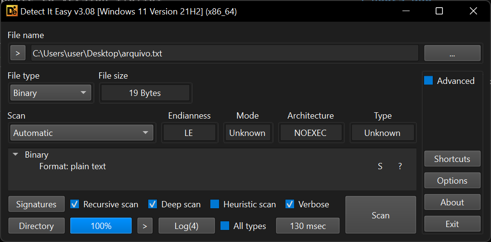

# 🗂️ Arquivos

Provavelmente você já se deparou com diversos arquivos, mas será que já pensou numa definição para eles? Defino arquivo como uma sequência de _bytes_ armazenada numa mídia digital somados a uma entrada, um registro, no sistema de arquivos (_filesystem_) que os referencie. Vou tentar provar minha definição para você. Faça o seguinte teste: abra o Bloco de Notas, escreva "mentebinaria.com.br" (sem aspas) e salve num arquivo chamado `arquivo.txt`.

Se nosso estudo sobre _strings_ estiver correto, este arquivo deve possuir 19 _bytes_ de tamanho.

Agora vamos verificar o conteúdo deste arquivo. Abra-o num editor hexadecimal. O conteúdo deve consistir apenas dos seguintes _bytes_:


O conteúdo exibido é exatamente a _string_ "mentebinaria.com.br" em ASCII. Conferindo com Python, temos:

```python
>>> b'mentebinaria.com.br'.hex(' ')
'6d 65 6e 74 65 62 69 6e 61 72 69 61 2e 63 6f 6d 2e 62 72'
```

Ou seja, se o arquivo tem apenas 19 bytes, que são os _codepoints_ referentes aos caracteres da string, onde ficam armazenados seu nome, extensão, permissões, data e hora de criação, e todos os outros dados que não são o conteúdo, ou seja, os **metadados** do arquivo? Só pode ser em outro lugar no _filesystem_ né?

De fato, nos sistemas de arquivos modernos, os arquivos só possuem seu próprio conteúdo. Na prática, as referências a eles é que definem onde começam e onde terminam um arquivo.

A pergunta mais interessante para nós é, no entanto, em relação ao **tipo** de arquivo. Criamos o `arquivo.txt` com a extensão `.txt`, mas é bom lembrar que uma extensão de arquivo nada mais é que parte de seu nome e não mantém nenhuma relação com seu tipo real. A única forma de saber um tipo de arquivo é **inferindo** este tipo através de seu conteúdo. Ao olhar para o arquivo no editor hexadecimal, vimos que todos os _bytes_ do `arquivo.txt` pertencem à faixa de _codepoints_ da tabela ASCII, por isso podemos inferir que este é um arquivo de texto ASCII.

Claro que há maneiras mais práticas de se identificar o tipo de arquivo do que inspecionando seus _bytes_ um a um. No Windows, podemos utilizar softwares como o Detect It Easy. Ele possui uma base de assinaturas para reconhecer os _bytes_ de um arquivo e inferir seu tipo. Outros exemplos incluem o TrID (Windows) e o file/libmagic (GNU/Linux).



Veremos agora como trabalhar com arquivos mais complexos que os arquivos de texto.
