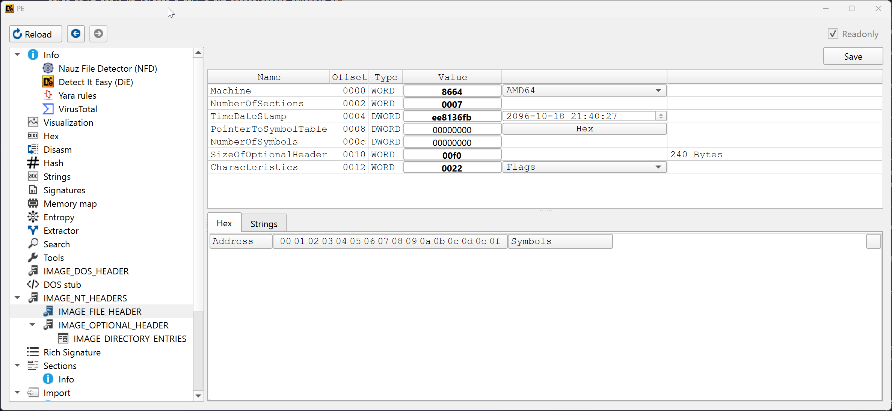

# COFF

Imediatamente após a assinatura PE temos o cabeçalho COFF (_Common Object File Format Specification_) às vezes chamado simplesmente de Cabeçalho do Arquivo (_File Header_ ) ou mesmo Cabeçalho do Arquivo PE (_PE File Header_). Trata-se de um cabeçalho especificado antes mesmo do formato PE para o sistema operacional VAX/VMS (depois chamado de OpenVMS) da DEC (empresa comprada pela Compaq, que por sua vez, foi comprada pela HP) na década de 70. A razão pela qual a Microsoft teria aproveitado o formato COFF é que boa parte dos engenheiros do time que desenvolveu o Windows NT trabalhavam para a DEC antes.

O cabeçalho COFF possui apenas 20 _bytes_ e é representado pela seguinte estrutura:

```c
typedef struct {
    uint16_t Machine;
    uint16_t NumberOfSections;
    uint32_t TimeDateStamp;
    uint32_t PointerToSymbolTable;
    uint32_t NumberOfSymbols;
    uint16_t SizeOfOptionalHeader;
    uint16_t Characteristics;
} IMAGE_FILE_HEADER, IMAGE_COFF_HEADER;
```

Vamos à definição dos campos importantes para nós:

## Machine

Campo de 2 _bytes_ que define a arquitetura da máquina para qual o programa foi construído. Valores comuns incluem 0x8664 para executáveis x86-64 de 64-bits, 0x14c para executáveis x86 de 32-bits e 0xaa64 para executáveis ARM de 64-bits. A tabela completa está disponível na documentação oficial do formato.

## NumberOfSections

Também de 2 _bytes_, o valor deste campo é o número de seções que o arquivo PE em questão possui. As seções serão estudadas mais a frente.

## TimeDateStamp

Este é um número de 32 _bits_ que define o número de segundos desde à meia-noite do dia 1 de Janeiro de 1970, conhecido também por _Epoch time_. Com este valor é possível saber quando o arquivo foi criado.

Vale dizer que este campo não é utilizado pelo _loader_ de arquivos PE no Windows e seu valor pode ser alterado pelo compilador ou após a compilação, logo, não é 100% confiável, ou seja, você **não pode garantir** que um binário PE foi compilado na data e hora informadas pelo valor neste campo.

## SizeOfOptionalHeader

Contém o tamanho do próximo cabeçalho, conhecido como Cabeçalho Opcional, que estudaremos muito em breve.

## Characteristics

Campo que define alguns atributos do arquivo. Este campo é uma **máscara de bits**, ou seja, cada _bit_ desses 2 _bytes_ diz respeito à uma característica específica do binário. Não cabe aqui explicar todos os possíveis valores, mas os mais comuns são:

| Bit | Nome                               | Comentários                            |
| --- | ---------------------------------- | -------------------------------------- |
| 1   | IMAGE\_FILE\_EXECUTABLE\_IMAGE     | Obrigatório para arquivos executáveis  |
| 5   | IMAGE\_FILE\_LARGE\_ADDRESS\_AWARE | Pode endereçar mais de 2 GB de memória |
| 8   | IMAGE\_FILE\_32BIT\_MACHINE        | O arquivo é de 32-bits                 |
| 13  | IMAGE\_FILE\_DLL                   | O arquivo é uma DLL                    |

Vamos analisar novamente o executável da calculadora. Considere que:

* Logo após a assinatura PE na posição 0x100, temos o primeiro campo do cabeçalho COFF que é o **Machine**. Ele é um campo de 2 _bytes_ conforme já dito, então os _bytes_ 0x64 e 0x86 definem seu valor. Considerando o _endianness_, chegamos ao valor 0x8664, que define que este executável foi criado para rodar em computadores com processadores de arquitetura x86-64.
* Em seguida, na posição 0x106, temos o **NumberOfSections** que é 7.
* Depois vem o campo **TimeDateStamp** com o número inteiro de 32 _bits_ (4 _bytes_) sem sinal 0xee8136fb que é 4001445627 em decimal.

* Pulamos então 8 _bytes_ referentes aos campos **PointerToSymbolTable** e **NumberOfSymbols** (normalmente zerados mesmo), encontrando a _word_ **SizeOfOptionalHeader** em 0x114 cujo valor é 0xf0.
* A próxima _word_ é o valor do campo **Characteristics**, que neste arquivo é 0x22. Convertendo para binário temos o valor 00100010. Contando-se a partir de zero e da direita para a esquerda, identificamos que os _bits_ 1 e 5 estão ligados, significando que o executável pode endereçar mais de 2 GB de memória, o que é comum em executáveis de 64-bits.


Em algumas referências o leitor encontrará o cabeçalho COFF como parte do cabeçalho NT (IMAGE\_NT\_HEADER), onde o primeiro campo é chamado de _Signature Bytes_, que é onde fica a assinatura PE para binários PE, mas também pode conter os bytes equivalentes das strings NE, LE ou MZ (executáveis puros de MS-DOS). Na verdade o COFF é uma especificação completa para arquivos do tipo "código-objeto", mas não exploraremos seu uso além do formato PE neste livro.


## Exercício

Abra o **Developer Command Prompt for VS 2022** (ele é instalado junto ao Visual Studio Community) e exiba o COFF/File Header do binário da calculadora do Windows:

```
dumpbin /nologo /headers c:\windows\system32\calc.exe
```

Você deve ver uma saída parecida com essa:

```
Dump of file c:\windows\system32\calc.exe

PE signature found

File Type: EXECUTABLE IMAGE

FILE HEADER VALUES
            8664 machine (x64)
               7 number of sections
        EE8136FB time date stamp
               0 file pointer to symbol table
               0 number of symbols
              F0 size of optional header
              22 characteristics
                   Executable
                   Application can handle large (>2GB) addresses
--suprimido--
```

O que o **dumpbin** e outros analisadores de PE fazem é interpretar toda a estrutura do arquivo com base na documentação do formato PE e produzir uma saída mais legível.

Com o **Detect It Easy**, também é possível ver os cabeçalhos de um PE. Para ver o cabeçalho COFF, abra o executável no DIE e marque a caixa de seleção **Advanced**. Clique no botão **PE** e no menu à esquerda escolha **IMAGE_FILE_HEADER**. Você deve ver uma janela como esta:



Aproveite e nague pelo programa para descobrir mais detalhes sobre o arquivo antes de irmos para o Cabeçalho Opcional.
