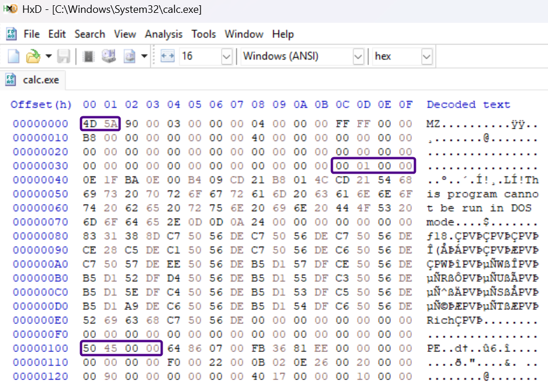

# MS-DOS

Não estranhe o nome deste cabeçalho. Ele é parte do que chamamos de **stub do MS-DOS:** um executável completo de MS-DOS presente no início de todo executável PE para fins de retrocompatibilidade.

Sendo assim, todo executável PE começa com este cabeçalho que é definido pela seguinte estrutura:

```c
typedef struct {
    uint16_t e_magic;
    uint16_t e_cblp;
    uint16_t e_cp;
    uint16_t e_crlc;
    uint16_t e_cparhdr;
    uint16_t e_minalloc;
    uint16_t e_maxalloc;
    uint16_t e_ss;
    uint16_t e_sp;
    uint16_t e_csum;
    uint16_t e_ip;
    uint16_t e_cs;
    uint16_t e_lfarlc;
    uint16_t e_ovno;
    uint16_t e_res[4];
    uint16_t e_oemid;
    uint16_t e_oeminfo;
    uint16_t e_res2[10];
    uint32_t e_lfanew;
} IMAGE_DOS_HEADER;
```

Este cabeçalho possui 64 _bytes_ de tamanho. Para chegar a esta conclusão basta somar o tamanho de cada campo, onde **uint16\_t** é um **tipo** na linguagem C que define uma variável de 16 _bits_ ou 2 _bytes_. Os seguintes campos variam deste tamanho:

* uint16\_t e\_res\[4] que é um _array_ de 4 campos de 16 _bits_, totalizando em 64 _bits_ ou 8 _bytes_.
* uint16\_t e\_res2\[10] que é um _array_ de 10 campos de 16 _bits_, totalizando em 160 _bits_ ou 20 _bytes_.
* uint32\_t e\_lfanew que é um campo de 32 _bits_ ou 4 _bytes_.

Os outros 16 campos possuem o tamanho de um **uint16\_t** (16 _bits_ ou 2 _bytes_). Então somando os tamanhos de todos os campos, temos 64 bytes.

Por ser um cabeçalho ainda presente no formato PE somente por questões de compatibilidade com o MS-DOS, não entraremos em muitos detalhes, mas estudaremos alguns de seus campos a seguir.

## **e\_magic**

Este campo de 2 _bytes_ sempre contém os valores 0x4d e 0x5a, que são os caracteres 'M' e 'Z' na tabela ASCII. Portanto é comum verificar que todo arquivo executável do Windows que segue o formato PE começa com tais valores, que representam as iniciais de Mark Zbikowski, um dos criadores deste formato para o MS-DOS.

Podemos utilizar um editor hexadecimal como o **HxD** para verificar tal informação. Vamos abrir, em caráter de exemplo, o executável da calculadora no Windows, normalmente em _C:\Windows\System32\calc.exe_.



Perceba os _bytes_ 0x4d e 0x5a logo no início do arquivo.

> O **HxD** exibe um caractere de ponto (.) na coluna **Decoded text** quando o _byte_ não está na faixa ASCII imprimível. Esta é uma decisão de quem programou o editor hexadecimal. Outras opções comum incluem exibir um caractere de espaço.

## e\_lfanew

O próximo campo importante para nós é o _e\_lfanew_, um campo de 4 _bytes_ cujo valor é a posição no arquivo do que é conhecido por **assinatura PE**, uma sequência fixa dos seguintes 4 _bytes_: 50 45 00 00.

Como o cabeçalho do DOS possui um tamanho fixo, seus campos estão sempre numa **posição** fixa no arquivo. No entanto, seus valores podem variar de arquivo para arquivo. No caso do _e\_lfanew_, se fizermos as contas, veremos que ele sempre está na **posição 0x3c** (ou 60 em decimal), já que ele é o último campo de 4 _bytes_ de um cabeçalho de 64 _bytes_.

Para ver o valor deste campo rapidamente podemos pedir ao **HxD** que vá para a posição 0x3c. Clique em **Search** -> **Go to...** ou aperte Ctrl+G. Certifique-se de que as opções "hex" e "begin" estão selecionadas e clique em **OK**.

No meu arquivo, assim como na imagem anterior, os quatro _bytes_ nesta posição são 00 01 00 00. Sabendo que números são armazenados em _little-endian_, devemos ler este número como 00 00 01 00, ou seja, 0x0000100 ou simplesmente 0x100. Este é então o endereço da assinatura PE, que consiste numa sequência dos seguintes 4 _bytes_: 0x50 0x45 0x00 0x00.

> Perceba que os dois primeiros _bytes_ na assinatura PE possuem representação ASCII justamente das letras 'P' e 'E' maiúsculas. Sendo assim, essa assinatura pode ser escrita como "PE\0\0", no estilo C string.

Logo após o cabeçalho do DOS, há o código do programa que vai imprimir na tela uma mensagem de erro caso um usuário tente rodar este arquivo PE no MS-DOS. Normalmente o texto impresso na tela é:

```
This program cannot be run in DOS mode.
```

Depois disso o programa sai. Mas este pequeno programa de MS-DOS é adicionado pelo compilador (pelo _linker_ mais especificamente) e seu conteúdo pode variar, pois não há um padrão rígido a ser seguido.

## Exercício

Para por em prática a análise desta primeira parte do arquivo PE, abra o executável da calculadora do Windows (normalmente em _C:\Windows\System32\calc.exe_) no HxD.

Note que:

* Logo no início do arquivo, há o número mágico "MZ".
* Na posição 0x3c, ou seja, no campo _e\_lfanew_, há o endereço da assinatura PE (0x100 no caso deste executável, mas pode ser diferente no seu ambiente).
* Logo após os 4 _bytes_ do campo _e\_lfanew_, começa o código do _stub_ do DOS, sempre no _offset_ 0x40, com uma sequência de _bytes_ que não fazem sentido para nós por enquanto (veja que o texto impresso na tela pelo programa é todavia bem visível).
* Finalmente, na posição 0x100 encontra-se a assinatura PE\0\0. Aqui sim, começa o formato PE propriamente dito.
