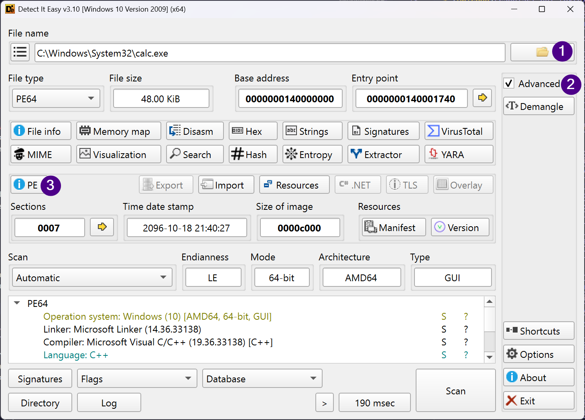
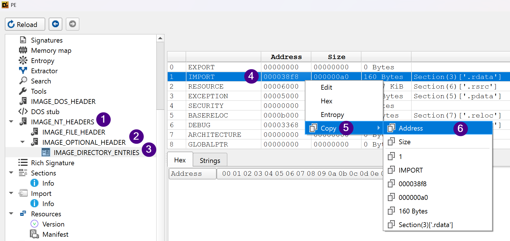
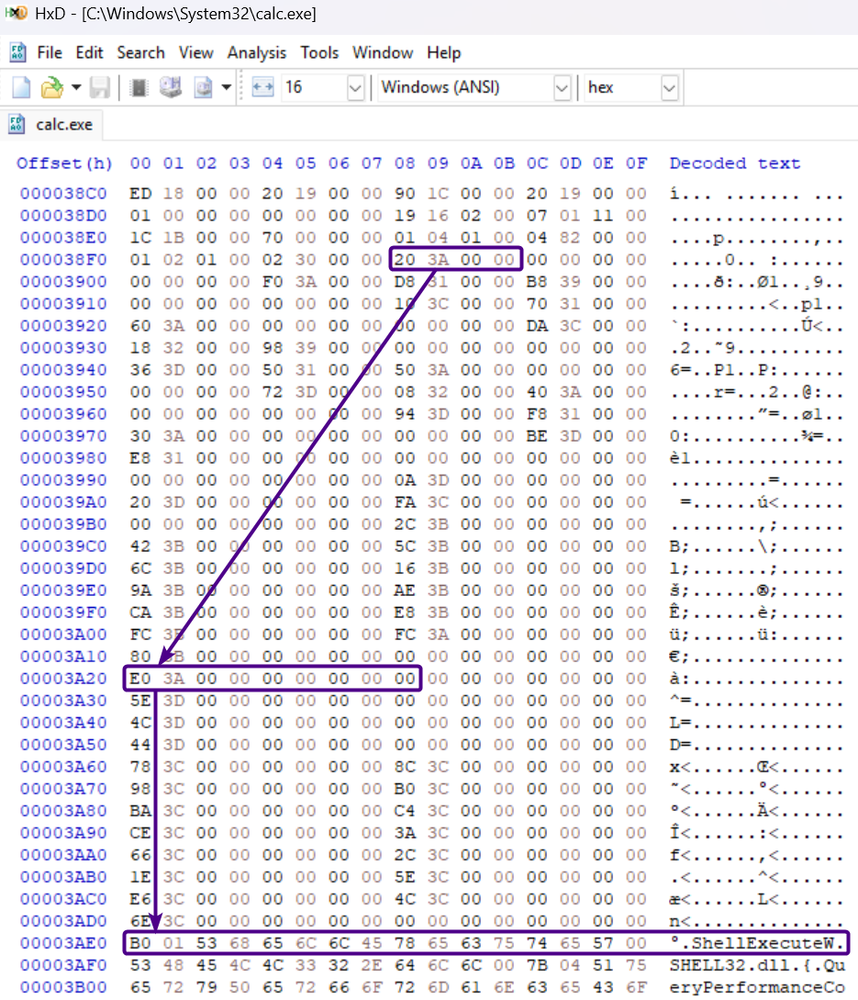

# Import Table

Foi visto que no diretório de dados _Import Table_ há um ponteiro para a IDT \(_Import Directory Table_\), apontado pelo valor do campo _VirtualAddress_. Vamos conhecer essa IDT de uma vez.

## Import Directory Table

A IDT é um _array_ de estruturas do tipo IMAGE\_IMPORT\_DESCRIPTOR definidas a seguir:

```c
typedef struct {
    uint32_t RvaImportLookupTable; // Antigo OriginalFistThink
    uint32_t TimeDateStamp;
    uint32_t ForwarderChain;
    uint32_t Name;
    uint32_t RvaImportAddressTable; // Antigo FirstThunk (ou Thunk Table)
} IMAGE_IMPORT_DESCRIPTOR;
```

> Não se deve confundir esta IDT \(_Import Descriptor Table_\) com outra IDT \(_Interrupt Descriptor Table_\). Esta última é uma estrutura que mapeia interrupções para seus devidos _handlers_, assunto que foge do escopo deste livro.

O número de elementos do _array_ de estruturas IMAGE\_IMPORT\_DESCRIPTOR é igual ao número de bibliotecas que o executável PE depende, ou seja, o número de diferentes DLLs das quais o executável importa funções. Há ainda um elemento final, completamente zerado \(preenchido com _null bytes_\) para indicar o fim do _array_.

### RvaImportLookupTable

O campo _RvaImportLookupTable_ (antigamente conhecido por _OriginalFirstThunk_ que era unido com _Characteristics_) aponta para uma tabela chamada de _Import Lookup Table \(ILT\)_

#### Import Lookup Table (ILT)

Essa tabela é um _array_ de números de 64-bits \(ou 32-bits para PE32\). Para cada um desses números, seu _bit_ mais significativo _\(MSB - Most Significant Bit\)_, se ligado, define que a função será importada por número. Se desligado, a função é importada por nome. Os _bits_ remanescentes guardam um endereço para uma estrutura que finalmente contém o nome da função. Essa estrutura é chamada de _Hint/Name Table_.

##### Hint/Name Table

Os elementos desta tabela obedecem a seguinte estrutura:

```c
typedef struct {
	uint16_t Hint;
	uint8_t Name[1];
} IMAGE_IMPORT_BY_NAME;
```

Onde _Name_ possui tamanho variável pois contém o nome da função a ser importada.

Note que o número de entradas na ILT (número de elementos deste _array_) é igual ao número de funções importadas por uma DLL em particular definida na IDT.

### Name

Este campo contém o endereço de uma _string_ que é o nome da DLL importada. Por exemplo: _SHELL32.dll_. A _string_ é terminada em _null_.

### RvaImportAddressTable

Este campo aponta finalmente para o que chamamos de _IAT \(Import Address Table\)_, muito conhecida por quem faz engenharia reversa. Essa tabela é em princípio idêntica à _Import Lookup Table_, mas no processo de carregamento do executável \(_load time_, que estudaremos mais à frente no livro\), ela é preenchida com os endereços reais das funções importadas. Isto porque um executável dinamicamente _linkado_ não sabe, antes de ser carregado em memória, qual o endereço de cada função de cada DLL que ele precisa chamar.

É importante lembrar o conceito de biblioteca compartilhada aqui. A ideia é ter apenas uma cópia dela carregada em memória e todos os programas que a utilizam podem chamar suas funções. Esta é a razão para o longo esquema de preenchimento da IAT pelo _loader_.


## Exercícios

Para fixar este conteúdo, é importante validar o que foi aprendido. Abra o executável da calculadora no **DIE**, marque a caixa **Advanced** se já não estiver marcada e clique no botão **PE** como a imagem a seguir mostra:



No menu da esquerda, vá em **IMAGE_NT_HEADERS -> IMAGE_OPTIONAL_HEADER -> IMAGE_DIRECTORY_ENTRIES** e copie o endereço (coluna **Address**) do segundo diretório, que é justamente o endereço da IDT, como a imagem a seguir ilustra:



> Perceba que o DIE chama o campo _VirtualAddress_ dos diretórios apenas de _Address_. Inconsistências assim podem ocorrer em várias ferramentas e literaturas, mas se você souber do que se trata, vai sempre se dar bem, mesmo que nomes diferentes sejam usados para se referir à mesma coisa.

Agora no **HxD**, abra o mesmo binário e vá até este _offset_ da IDT com o Ctrl+G. No binário que usei aqui o endereço é 0x38f8.

Lá, os primeiros quatros _bytes_ são o valor do campo _RvaImportLookupTable_ do primeiro elemento do _array_. Se você seguir este _offset_, vai chegar na ILT. O primeiro elemento da ILT é um número de 64-bits, ou seja, de 8 _bytes_ que aponta para a _Hint/Name Table_. Nesta tabela, o nome da função começa no terceiro _byte_ conforme definição, logo após o campo _Hint_.



Como desafio adicional, descubra à qual DLL a função pertence apenas olhando para a imagem anterior. Dica: busque pelo campo _Name_ da IDT e siga o valor que ele contém neste binário.
