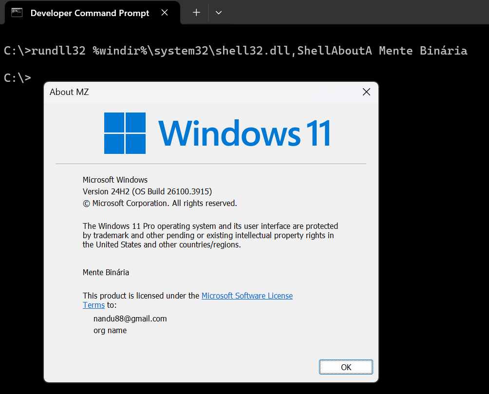

# Bibliotecas

As bibliotecas, ou DLLs no Windows, são também arquivos PE, mas sua intenção é ter suas funções utilizadas (importadas e chamadas) por arquivos executáveis. Elas também importam funções de outras bibliotecas, mas além disso, **exportam** funções para serem utilizadas.

Novamente, é possível utilizar o DIE para ver as funções importadas e exportadas por uma DLL, mas no exemplo a seguir, utilizamos novamente o **dumpbin** contra a biblioteca `Shell32.dll`, nativa do Windows:

```
C:\>dumpbin /exports %windir%\system32\shell32.dll | findstr /i shellab
        568  1A7 002D7D90 ShellAboutA
        569  1A8 002D7EC0 ShellAboutW
```

Utilizamos o comando **findstr** do Windows para filtrar a saída por funções que criam caixas de mensagem. Este comando é como o **grep** no Linux. A sua opção **/i** faz com que o filtro de texto ignore o case (ou seja, funciona tanto com letras maiúsculas quanto com minúsculas).

Para chamar uma função desta DLL, teríamos que criar um executável que a **importe**. No entanto, o próprio Windows já oferece um utilitário chamado _rundll32.exe_, capaz de chamar funções de uma biblioteca. Ele é bem limitado, mas para este exemplo funciona. A maneira via linha de comando é:

```
C:\>rundll32 <DLL>,<Função> <Parâmetros>
```

Como a função _ShellAboutA()_ recebe um texto ASCII para ser exibido na tela "Sobre" do Windows, podemos testá-la da seguinte forma:



> Utilizar o _rundll32.exe_ para chamar funções de biblioteca não é a maneira mais adequada de fazê-lo e não funciona com todas as funções, principalmente as que precisam de parâmetros que não são do tipo _string_. Somente o utilizamos aqui para exemplificar a chamada de funções exportadas por uma DLL.

Tanto para DLLs quanto para executáveis, quando eles rodam, um processo é criado. Vamos agora ver que isto significa.
