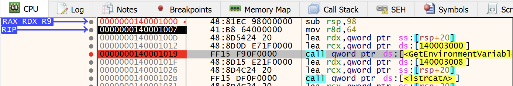
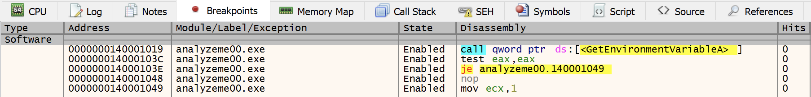

# Breakpoints

Um _breakpoint_ nada mais é que um ponto no código onde o _debugger_ vai parar para que você analise o que precisa. É o mesmo conceito dos _breakpoints_ presentes em ambientes de desenvolvimento como Visual Studio, NetBeans ou CodeBlocks. A diferença é que nestes ambientes colocamos _breakpoints_ em determinadas linhas do código-fonte. Já nos _debuggers_ destinados à engenharia reversa, colocamos _breakpoints_ em **endereços** (VAs), onde normalmente há instruções.

## Seu Primeiro _Breakpoint_

Há várias maneiras de se colocar um _breakpoint_ em um endereço utilizando o x64dbg. Você pode selecionar a instrução e pressionar F2, usar um dos comandos SetBPX/bp/bpx, dar um duplo clique sobre os _bytes_ da instrução (coluna 3 no disassembly) ou simplesmente clicar na bolinha cinza à esquerda do endereço (coluna 1 do disassembly). Ao fazê-lo, este ficará com um fundo vermelho, como mostra a imagem:

Um segundo clique na bolinha desabilita o _breakpoint_, mas não o exclui da aba **Breakpoints** (Alt+B). Um terceiro clique o exclui totalmente.

Após colocar o _breakpoint_ nesta CALL, rode o programa (F9). O que acontece? O _debugger_ executa todas as instruções anteriores a este _breakpoint_ e pára onde você pediu. Simples assim.

## Como _Breakpoints_ são Implementados

Talvez você tenha notado que ao atingir um _breakpoint_, o x64dbg mostra na barra de status a palavra “Paused” e a frase **INT3 breakpoint at analyzeme00.0000000140001019!**. Este é um tipo de **breakpoint de software**. Para entender como ele funciona, acompanhe a explicação a seguir.

A instrução INT é uma instrução Assembly que gera uma interrupção. A interrupção número 3 é chamada de **Breakpoint Exception (#BP)** no manual da Intel. Seu _opcode_ (0xcc) tem somente um _byte_, o que facilita sua implementação nos _debuggers_.

De forma resumida, para parar nesta CALL, o que o x64dbg faz é:

1. Substituir o primeiro _byte_ do _opcode_ da CALL (0xff, neste caso) por 0xcc e salvar o original numa memória.
2. Rodar o programa.
3. Restaurar o primeiro _byte_ do _opcode_ da CALL, substituindo o 0xcc por 0xff (neste caso).

Isso poderia ser feito manualmente, mas os _debuggers_ facilitam o trabalho, bastando você pressionar F2 ou clicar na bolinha para que todo este trabalho seja executado em segundo plano, sem que o usuário perceba. Incrível, não é?

Você pode adicionar quantos _breakpoints_ de software quiser numa sessão de _debugging_. Todos ficam acessíveis na aba **Breakpoints**, a não ser que você os exclua. Veja como eles ficam organizados:

Você também pode assistir a [aula do CERO][1], que trata sobre este assunto.

> Existem ainda os _breakpoints_ de memória e de hardware, mas não trataremos deles neste livro.

[1]: https://youtu.be/823KK-FYV9s
