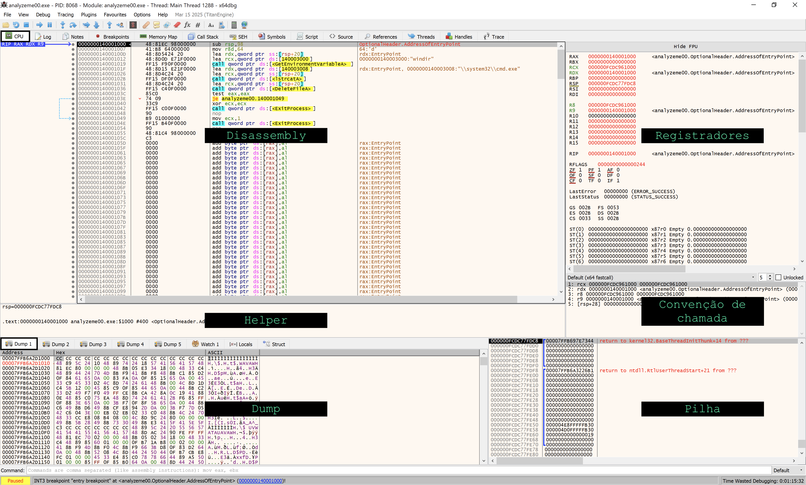

# O Debugger

## Instalação

1. Na sua máquina Windows, baixe o _snapshot_ mais recente do x64dbg. É um arquivo .zip chamado _snapshot\_YYYY-MM-DD\_HH-MM.zip_ que vai variar dependendo da data e hora do _release_ (quando o software é liberado) pelos autores do projeto.
2. Ao descompactar o arquivo .zip, execute o arquivo _x96dbg.exe_ dentro do diretório _release_. Esse nome deve-se ao fato de que o x64dbg tem suporte tanto a 64 quanto a 32-bits, então o autor resolveu somar 32+64 e nomear o binário assim.
3. O _x96dbg.exe_ é o _launcher_ do x64dbg e tem três botões. Escolha **Install** e responda "Sim" para todas as perguntas.
4. À esta altura você já deve ter o atalho x64dbg na sua área de trabalho. Dê um duplo-clique nele e você verá a tela inicial do _debugger_.

## Configuração

Se o x64dbg estiver em português, mude o idioma para inglês. Isso é necessário, pois vários termos em inglês não estão traduzidos e isso pode dificultar o aprendizado. Para mudar o idioma, vá em **Opções -\> Idiomas** e escolha **[en\_US] American English - United States**. Você precisará fechar o x64dbg e abri-lo novamente para que o novo idioma entre em vigor. Depois que o software estiver em inglês, siga com a configuração:

1. Vá em **Options -\> Preferences** e, na aba **Events**, desmarque a caixa **System Breakpoint**. Isso vai fazer com que o _debugger_ pare direto no _entrypoint_ de um programa ao abrirmos.
2. Clique na aba **Engine** e marque a caixa **Disable ASLR**, que desabilita a randomização de endereços de memória.
3. Clique em **Save**.

Existem muitas outras opções de configuração que você pode experimentar. Para o momento, essas bastam.

## Tela Inicial

Na tela inicial do x64dbg, clique em **File ► Open**. Localize o arquivo `analyseme00.exe` e clique em em **Open**. Você deverá ver uma tela como esta:

A aba **CPU**, realçada em preto, é sem dúvida a mais utilizada no processo de _debugging_, por isso, fizemos questão de nomear algumas de suas áreas, que descreveremos agora.

### Disassembly

Nesta região são exibidos os endereços (VAs), _opcodes_ e argumentos de cada instrução, seu _disassembly_ (ou seja, o que os _bytes_ significam em Assembly) e alguns comentários na quarta coluna, que podem ser automáticos (gerados pelo x64dbg ou por plugins) ou inseridos por você. No endereço inicial, por exemplo, há o texto _OptionalHeader.AddressOfEntryPoint_ na quarta coluna, que nos diz que aquela instrução é a primeira executada pelo programa. Dizemos também que ela é o _entrypoint_ do programa.

### Helper

Tomei a liberdade de nomear essa seção de **Helper**, porque de fato ela ajuda. Por exemplo, quando alguma instrução faz referência a um dado em memória ou em um registrador, ela já mostra que dado é este. Assim você não precisa ir buscar. É basicamente um economizador de tempo. Para entender melhor, suponha que o _debugger_ esteja parado numa instrução que esteja lendo de `[rsp+20]`. No Helper, aparecerá o valor que está na posição de memória RSP+20, assim você não precisa ir até lá manualmente para ver tal valor.

### Dump

O dump é um visualizador que você pode usar para inspecionar _bytes_ em qualquer endereço. Por exemplo, você pode ir até o endereço RSP+20 e ver o que tem lá.

Há cinco abas de dump, onde cada uma pode mostrar o conteúdo de uma região de memória diferente para o mesmo alvo. Há ainda as abas **Watch**, **Locals** e **Struct**, que fogem do escopo deste livro, mas também são ferramentas de inspeção.

### Registradores

Como o nome sugere, nesta região são mostrados os valores de cada registrador do processador, incluindo o do registrador de _flags_. Na verdade, o x64dbg vai um pouco além e mostra também variáveis globais úteis como `LastError` e `LastStatus`, ambas modificadas por chamadas à algumas funções da API do Windows.

### Convenção de Chamada

Nesta janela é possível configurar a convenção de chamada com a qual estamos trabalhando e o número de argumentos que você quer ver em cada chamada de função.

### Pilha

Mostra a pilha de memória, onde o endereço com fundo em preto indica o topo da pilha, ou seja, o endereço que está em RSP.

Na próxima seção, iremos depurar o binário de exemplo e devemos nos atentar às informações exibidas em cada uma das regiões da tela do _debugger_, acima apresentadas.
