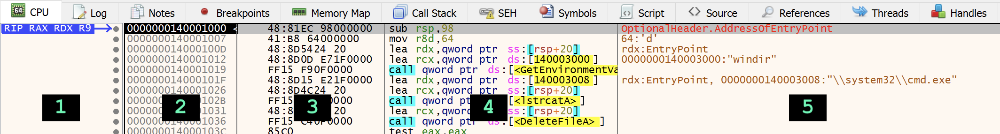

# Disassembly

Ao observar a região que chamamos de _disassembly_, você verá cinco colunas. A primeira exibe algumas informações e relações entre endereços. A segunda mostra os endereços em si. A terceira mostra os _bytes_ do _opcode_ e dos operandos das instruções. A quarta mostra os mnemônicos onde podemos ler Assembly e, por fim, a quinta mostra comentários, sejam estes gerados automaticamente pelo _debugger_ ou adicionados por você.

## Realce de Instruções

Perceba que por padrão o _debugger_ já realça (_highlight_ em inglês) vários aspectos das instruções na janela de _disassembly_. As instruções CALL estão com fundo azul e os destinos das chamadas com fundo amarelo quando o endereço é conhecido. Os saltos também são realçados com fundo amarelo. Dessa forma é possível identificar rapidamente as instruções que alteram o fluxo do execução do programa.

O endereço para o qual o ponteiro de instrução (RIP) aponta é destacado com um fundo preto.

Na coluna de comentários, temos os comentários automáticos em marrom.

É importante lembrar que o conteúdo do arquivo sendo depurado é composto somente pelos _bytes_ referentes às instruções (terceira coluna) e dados. Toda essa análise adicional é feita pelo _debugger_ para que a nossa experiência seja mais agradável ao depurar o programa.

## Executando Uma Instrução

Neste primeiro momento, o _debugger_ está parado e a próxima instrução a ser executada é justamente o que chamamos de EP _(EntryPoint)_.

O primeiro comando que aprenderemos é o **Step over**, que pode ser ativado de pelo menos quatro maneiras:

1. Menu **Debug ► Step over**.
2. Botão **Step over** na barra de botões (por padrão, é o sétimo botão).
3. Tecla de atalho F8.
4. Digitando um dos comandos a seguir na barra de comandos: `StepOver`, `step`, `sto`, ou `st`.

Se você emitir este comando uma vez, verá que o _debugger_ vai executar uma única instrução e parar. Na janela do _disassembly_, você vai perceber que o cursor (RIP) "pulou uma linha" e a instrução anterior foi executada. No caso de nosso binário de teste, é a instrução SUB RSP, 98. Após sua execução, perceba que o valor de RSP foi atualizado. Os valores que mudaram são destacados em vermelho pelo x64dbg.

Você pode seguir teclando F8 até alcançar a primeira instrução CALL, destacada por um fundo azul claro.

O comando **Step over** sobre uma CALL faz com que o _debugger_ execute a rotina apontada pela instrução e "volte" para o endereço imediatamente após a CALL. Você não verá essa execução, pois o _debugger_ não a instrumentará, mas ela acontece. Caso queira observar o que foi executado "dentro" da CALL, é necessário utilizar o **Step into** (F7). Vamos fazer dois testes:

1. Com o RIP apontado para a CALL em 140001019, tecle F8. Você verá que a execução simplesmente "passa para a linha abaixo da CALL". Isso quer dizer que ela **foi executada**, mas você não "viu" essa execução no _debugger_.
2. Agora reinicie o programa no _debugger_ clicando em **Debug ► Restart**. Depois, vá teclando F8 até chegar sobre a CALL novamente e tecle F7, que é o **Step into**. Perceba que o _debugger_ agora "entrou" na CALL. Não se preocupe em analisar essa função. Ela pertence à API do Windows e seu funcionamento é conhecido. A ideia aqui é você diferenciar o _Step over_ do _Step into_. Pode reiniciar o programa novamente.

## Rodando o Programa

Outro comando importante é o **Run** (F9). Ele simplesmente inicia a execução a partir do RIP de todas as instruções subsequentes e só para se encontrar um _breakpoint_ (nosso próximo assunto), uma exceção ou se o programa for encerrado. Se você der este comando, verá a execução terminada em menos de um segundo, o que significa que o programa rodou até o final e saiu. Aí basta reiniciar o programa (Ctrl + F2) para recomeçar nossos estudos. ;)

Na próxima seção, vamos entender os pontos de paradas, mais conhecidos como _breakpoints_.
