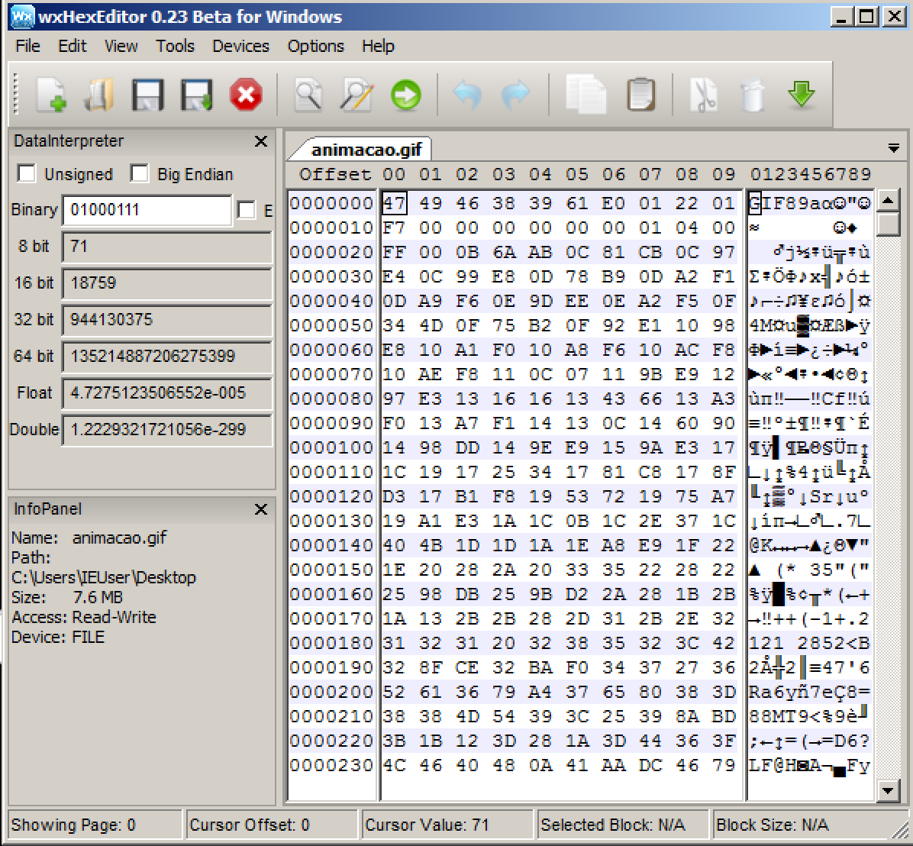

# Formatos

Os arquivos de texto, sejam eles ASCII ou UNICODE são tipos de arquivos bem simples. Começaremos agora a avaliar tipos de arquivos mais complexos. Acontece que para um programa **salvar** ou **abrir** um determinado tipo de arquivo, é essencial que este conheça seu **formato**. Tomemos por exemplo o formato GIF, mas agora ao invés de utilizar o **hd** para inspecionar seu conteúdo, utilizaremos, no Windows, um editor hexadecimal gráfico, o wxHexEditor.

Ao abrir o arquivo GIF no **wxHexEditor**, é exibida uma tela similar a abaixo:

Para entender como este tipo de _software_ funciona, vamos começar pelas colunas onde os _bytes_ estão organizados:

## **Offset em disco**

Define a **posição** no arquivo, em _bytes_. No exemplo acima, o primeiro _byte_ \(no _offset_ 0\) é o 0x47. O segundo é o 0x49 e assim por diante. Por padrão no **wxHexEditor** os _offsets_ estão em decimal, não em hexa. Identifique na imagem as afirmações a seguir:

* O _byte_ no _offset_ 122 é o 0xb1.
* A _word_ no _offset_ 226 é 0x3d 0x44.
* O _byte_ no _offset_ 0x11 \(17 em decimal\) é 1.


No **wxHexEditor** você pode exibir os _offsets_ em hexadecimal clicando com o botão direito do mouse sobre eles. Outros editores como o XVI32 já exibem o _offset_ em hexadecimal por padrão.


## **Conteúdo**

A próxima coluna exibe os _bytes_ em si. Sem segredos. Por serem editores hexadecimais, programas como o wxHexEditor exibem o conteúdo do arquivo em bytes hexadecimais separados por espaços, mas é importante lembrar que o conteúdo de um arquivo é uma sequência de bits em disco ou em outro dispositivo de armazenamento que, quando aberto num editor, tem seu conteúdo copiado para a memória. A maneira como estes bytes serão visualizados fica a cargo do programa que o abre. Por exemplo, se o editor exibisse os bytes em decimal, os primeiros dois bytes \(0x47 e 0x49\) seriam 71 e 73. Se fosse em binário, seria 1000111 e 1001001.

A esta altura o leitor já deve ter percebido que um número pode ser expresso de várias maneiras, no entanto, o sistema hexadecimal é bem otimizado para o engenheiro reverso.

## **Representação textual**

Na terceira coluna o **wxHexEditor** nos apresenta a interpretação ASCII de cada _byte_ na segunda coluna, ou seja, se o _byte_ em questão estiver dentro da faixa de caracteres ASCII imprimíveis \(de 0x20 à 0x7e\), sua representação é exibida. Para valores fora desta faixa, o **wxHexEditor** exibe um espaço em branco.

Há dezenas de outros editores hexadecimais disponíveis, inclusive alguns visualizadores de linha de comando. Vale consultar o apêndice Ferramentas e testar alguns. Se o leitor tiver curiosidade de saber como funciona um visualizador hexadecimal, recomendo olhar o código do hdump, disponível em https://github.com/merces/hdump, um visualizador para linha de comando que implementei em C para funcionar em Windows, Linux e macOS.

## **Exemplo do formato GIF**

De volta ao formato, é importante ressaltar que tanto o programador do software que salva um determinado tipo de arquivo quanto o programador de um software que visualiza tal tipo precisam conhecê-lo bem. Como exemplificamos com o formato GIF, vamos ver como este formato é definido. Em geral, os formatos são definidos por campos \(faixas de _bytes_\) de tamanho fixo ou variável, que podem assumir um certo valor. Para entendê-los, precisamos da documentação deste formato \(no caso, do GIF\). Conforme sua especificação, o formato GIF segue, dentre outras, as seguintes regras:

| Byte offset \(posição no arquivo\) | Tamanho do campo em bytes | Valor em hexadecimal | Descrição |
| :--- | :--- | :--- | :--- |
| 0 | 6 | 47 49 46 38 39 61 | Cabeçalho |
| 6 | 2 | &lt;variável&gt; | Largura em pixels |
| 8 | 2 | &lt;variável&gt; | Altura em pixels |

Seguindo esta tabela fornecida por quem desenhou o formato GIF e olhando o conteúdo do arquivo de exemplo na imagem anterior, podemos verificar que o primeiro campo, de 6 _bytes_, casa exatamente com o que está definido no padrão. Os _bytes_ são a sequência 0x47, 0x49, 0x46, 0x38, 0x39 e 0x61 que representam a sequência em ASCII GIF89a. É bem comum ao definir formatos de arquivo que o primeiro campo, normalmente chamado de cabeçalho \(_header_\) ou número mágico \(_magic number_\) admita como valor uma representação ASCII que dê alguma indicação de que tipo de arquivo se trata. Por exemplo, os tipos de arquivo ZIP possuem o _magic number_ equivalente ao texto **PK**. Já o tipo de arquivo RAR começa com os _bytes_ equivalentes ao texto **Rar!**. Não é uma regra, mas é comum.


No exemplo do formato GIF o tamanho do primeiro campo é de 6 _bytes,_ mas nem todo _magic number_ possui este tamanho. Na verdade, não há regra.


Logo após o primeiro campo, temos o segundo campo, que define a largura em _pixels_ da imagem GIF, segundo sua documentação. Este campo possui 2 _bytes_ e, na imagem de exemplo, são os _bytes_ 0xe0 e 0x01. Aqui cabe explicar um conceito valioso que é o **endianess**. Acontece que na arquitetura Intel os _bytes_ de um número inteiro são armazenados de trás para frente \(chamado de _**little endian**_\). Sendo assim a leitura correta da largura em _pixels_ deste GIF é 0x01e0, ou simplesmente 0x1e0 \(já que zero à esquerda não conta\), que é 480 em decimal.

O próximo campo, também de 2 _bytes_, diz respeito a altura em _pixels_ da imagem GIF e possui o valor 0x122 \(já lendo os _bytes_ de trás para frente conforme explicado\), que é 290 em decimal. É correto dizer então que esta é uma imagem de 480 x 290 _pixels_.

É por isso que alguns sistemas operacionais, com o GNU/Linux, não consideram a extensão de arquivo como sendo algo importante para definir seu tipo. Na verdade, o conteúdo do arquivo o define.

Não seguiremos com toda a interpretação do formato GIF pois este foge ao escopo de estudo de engenharia reversa, mas vamos seguir a mesma lógica para entender o formato de arquivos executáveis do sistema Windows, objeto de estudo do próximo capítulo.

