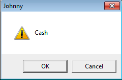

# Funções e Pilha

Apesar de não estudarmos todos os aspectos da linguagem Assembly, alguns assuntos são de extrema importância, mesmo para os fundamentos da engenharia reversa de software. Um deles é como funcionam as funções criadas em um programa e suas chamadas, que discutiremos agora.

## O que é uma Função

Basicamente, uma função é um **bloco de código reutilizável** num programa. Tal bloco faz-se útil quando um determinado conjunto de instruções precisa ser invocado em vários pontos do programa. Por exemplo, suponha um programa em Python que precise converter a temperatura de Fahrenheit para Celsius várias vezes no decorrer de seu código. Ele pode ser escrito assim:

```python
fahrenheit = 230.4
celsius = (fahrenheit - 32) * 5 / 9
print(celsius)

fahrenheit = 130.3
celsius = (fahrenheit - 32) * 5 / 9
print(celsius)

fahrenheit = 90.1
celsius = (fahrenheit - 32) * 5 / 9
print(celsius)
```

O programa funciona e a saída é a esperada:

```
110.22222222222223
54.611111111111114
32.27777777777778
```

No entanto, é pouco prático, pois repetimos o mesmo código várias vezes. Além disso, uma versão compilada fica maior em _bytes_. Toda esta repetição também prejudica a manutenção do código, pois se o programador precisar fazer uma alteração no cálculo, vai ter que alterar em todos eles. É aí que entram as funções. Analise a seguinte versão do mesmo programa:

```python
def fahrenheit2celsius(fahrenheit):
    return (fahrenheit - 32) * 5 / 9

celsius = fahrenheit2celsius(230.4)
print(celsius)

celsius = fahrenheit2celsius(130.3)
print(celsius)

celsius = fahrenheit2celsius(90.1)
print(celsius)
```

A saída é a mesma, mas agora o programa está utilizando uma função, onde o cálculo só foi definido uma única vez e toda vez que for necessário, o programa a chama.

Uma função normalmente tem:

1. Argumentos, também chamados de parâmetros, que são os dados que a função recebe, necessários para cumprir seu propósito.
2. Retorno, que é o resultado da conclusão do seu propósito, seja bem sucedida ou não.
3. Um nome (na visão do programador) ou um endereço de memória (na visão do processador).

Agora cabe a nós estudar como isso tudo funciona em baixo nível.


Nos primórdios da computação as funções eram chamadas de **procedimentos** (_procedures_). Em algumas linguagens de programação, no entanto, possuem tanto funções quanto procedimentos. Estes últimos são "funções que não retornam nada". Já no paradigma da programação orientada a objetos (POO), as funções de uma classe são chamadas de **métodos**.


## Funções em Assembly

Em baixo nível, uma função é implementada basicamente num bloco que não será executado até ser chamado por uma instrução CALL. Ao final de uma instrução, encontramos normalmente a instrução RET. Vamos analisar uma função simples de soma para entender:

```c
#include <stdio.h>

int soma(int x, int y) {
  return x+y;
}

int main(void) {
  printf("%d\n", soma(3,4));
  return 0;
}
```

Olha como ela fica compilada no Linux em 32-bits:

```
0804840b <soma>:
 804840b:       55                      push   ebp
 804840c:       89 e5                   mov    ebp,esp
 804840e:       8b 55 08                mov    edx,DWORD PTR [ebp+0x8]
 8048411:       8b 45 0c                mov    eax,DWORD PTR [ebp+0xc]
 8048414:       01 d0                   add    eax,edx
 8048416:       5d                      pop    ebp
 8048417:       c3                      ret

08048418 <main>:
...
 8048429:       6a 04                   push   0x4
 804842b:       6a 03                   push   0x3
 804842d:       e8 d9 ff ff ff          call   804840b <soma>
 8048432:       83 c4 08                add    esp,0x8
```

Removi partes do código intencionalmente, pois o objetivo neste momento é apresentar as instruções que implementam as chamadas de função. Por hora, você só precisa entender que a instrução CALL (no endereço 0x804842d em nosso exemplo) chama a função _soma()_ em 0x0804840b e a instrução RET (em 0x8048417) retorna para a instrução imediatamente após a CALL (0x8048432), para que a execução continue.

## A Pilha de Memória

A memória RAM para um processo é dividida em áreas com diferentes propósitos. Uma delas é a pilha, ou _stack_.

Essa área de memória funciona de forma que o que é colocado lá fique no topo e o último dado colocado na pilha seja o primeiro a ser retirado, como uma pilha de pratos ou de cartas de baralho mesmo. Esse método é conhecido por LIFO (_Last In First Out_).

Seu principal uso é no uso de funções, tanto para passagem de argumentos (parâmetros da função) quanto para alocação de variáveis locais da função (que só existem enquanto a função executa).

Na arquitetura IA-32, a pilha é alinhada em 4 _bytes_ (32-bits). Por consequência, todos os seus endereços também o são. Logo, se novos dados são colocados na pilha (empilhados), o endereço do topo é **decrementado** em 4 unidades. Se um dado for desempilhado, o endereço do topo é **incrementado** em 4 unidades. Perceba a lógica invertida, porque a pilha começa num endereço alto e cresce em direção a endereços menores.

Existem dois registradores diretamente associados com a pilha de memória alocada para um processo. São eles:

* O ESP, que aponta para o topo da pilha.
* O EBP, que aponta para a base do _stack frame_.

Veremos agora as instruções de manipulação de pilha. A primeira é a instrução PUSH (do inglês "empurrar") que, como o nome sugere, empilha um dado. Na forma abaixo, essa instrução faz com que o processador copie o conteúdo do registrador EAX para o topo da pilha:

```asm
push eax
```

Também é possível empilhar um valor literal. Por exemplo, supondo que o programa coloque o valor um na pilha:

```asm
push 1
```

Além de copiar o valor proposto para o topo da pilha, a instrução PUSH **decrementa** o registrador ESP em 4 unidades, conforme já explicado o motivo. Sempre.

Sua instrução antagônica é a POP, que só precisa de um registrador de destino para copiar lá o valor que está no topo da pilha. Por exemplo:

```asm
pop edx
```

Seja lá o que estiver no topo da pilha, será copiado para o registrador EDX. Além disso, o registrador ESP será **incrementado** em 4 unidades. Sempre.

Temos também a instrução CALL, que faz duas coisas:

1. Coloca o endereço da próxima instrução na pilha de memória (no caso do exemplo, 0x8048432).
2. Coloca o seu parâmetro, ou seja, o endereço da função a ser chamada, no registrador EIP (no exemplo é o endereço 0x804840b).

Por conta dessa atualização do EIP, o fluxo é desviado para o endereço da função chamada. A ideia de colocar o endereço da próxima instrução na pilha é para o processador saber para onde tem que voltar quando a função terminar. E, falando em terminar, a estrela do fim da festa é a instrução RET (de _RETURN_). Ela faz uma única coisa:

1. Retira um valor do topo da pilha e coloca no EIP.

Isso faz com que o fluxo de execução do programa volte para a instrução imediatamente após a CALL, que chamou a função.

## Análise da MessageBox

Vamos agora analisar a pilha de memória num exemplo com a função MessageBox, da API do Windows:

```
00401516 | push 31                                     |
00401518 | push msgbox.404000                          | 404000:"Johnny"
0040151D | push msgbox.404007                          | 404007:"Cash"
00401522 | push 0                                      |
00401524 | call <user32.MessageBoxA>                   |
```

Perceba que quatro parâmetros são empilhados antes da chamada à _MessageBoxA_ (versão da função _MessageBox_ que recebe _strings_ ASCII, por isso o sufixo **A**).

Os parâmetros são empilhados na ordem inversa.

Já estudamos o protótipo desta função no capítulo que apresenta a Windows API e por isso sabemos que o 0x31, empilhado em 00401516, é o parâmetro `uType` e, se o decompormos, veremos que 0x31 é um OU entre 0x30 (MB\_ICONEXCLAMATION) e 0x1 (MB\_OKCANCEL).

O próximo parâmetro é o número 404000, um ponteiro para a _string_ "Johnny", que é o título da mensagem. Depois vem o ponteiro para o texto da mensagem e por fim o zero (NULL), empilhado em 00401522, que é o _handle_.

O resultado é apresentado a seguir:



É importante perceber que, após serem compreendidos, podemos controlar estes parâmetros e alterar a execução do programa conforme quisermos. Este é o assunto do próximo capítulo, sobre depuração.

Assembly é, por si só, um assunto extenso e bastante atrelado à arquitetura e ao sistema operacional no qual se está trabalhando. Este capítulo apresentou uma introdução ao Assembly Intel x86 e considerou o Windows como plataforma. Dois bons recursos de Assembly, que tomam o Linux como sistema base, são os livros gratuito Aprendendo Assembly, do Felipe Silva e Linguagem Assembly para i386 e x86-64, do Frederico Pissara.
