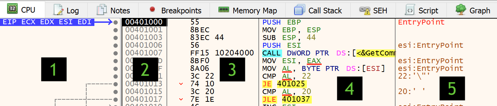

# Disassembly

Ao observar a região que chamamos de disassembly, você verá 5 colunas onde a primeira exibe algumas informações e relações entre endereços. A segunda mostra os endereços em si. A terceira mostra os _bytes_ do opcode e operandos das instruções. A quarta mostra as os mnemônicos onde podemos ler Assembly e por fim, a quinta mostra alguns comentários, sejam estes gerados automaticamente pelo debugger ou adicionados pelo usuário.

## Destaque de instruções

Perceba que por padrão o debugger já destaca vários aspectos das instruções, na janela de disassembly. O nome mais comum para este destaque é sua versão em inglês _highlight_.

O _highlight_ refere-se principalmente às cores, mas o debugger também dá altas dicas. Na instrução acima, perceba que a operação em si está em azul, enquanto o argumento está em verde.

O endereço para o qual o ponteiro de instrução aponta \(EIP, embora o x64dbg chame-o genericamente de CIP, já que em x86-64 seu nome é RIP\) é destacado com um fundo preto \(na imagem anterior, vemos que é o endereço 401000\).

Na coluna de comentários, temos os comentários automáticos em marrom.

É importante lembrar que no arquivo há somente os _bytes_ referentes às instruções \(terceira coluna\). Todo o resto é interpretação do debugger para que a leitura seja mais intuitiva.

## Step into/over

Neste primeiro momento, o debugger está parado e a próxima instrução a ser executada é justamente o que chamamos de OEP _\(Original EntryPoint\)_.

O primeiro comando que aprenderemos é o **Step over**, que pode ser ativado por pelo menos três lugares:

1. Menu **Debug -&gt; Step over**.
2. Botão **Step over** na barra de botões \(é o sétimo botão\).
3. Tecla de atalho F8.
4. Digitando um dos comandos a seguir na barra de comandos: StepOver/step/sto/st

Se você emitir este comando uma vez, verá que o debugger vai executar uma única instrução e parar. Na janela do disassembly, você vai perceber que o cursor \(EIP\) "pulou uma linha" e a instrução anterior foi executada. No caso de nosso binário de teste, é a instrução PUSH EBP. Após sua execução, perceba que o valor de EBP foi agora colocado no topo da pilha \(observe a pilha, abaixo dos registradores\).

Você pode seguir teclando F8 até alcançar a primeira instrução CALL em 401007, destacada por um fundo azul claro.

O comando **Step over** sobre uma CALL faz com que o debugger execute a rotina apontada pela instrução e "volte" para o endereço imediatamente após a CALL. Você não verá essa execução, pois o debbugger não a instrumentará. Caso queira observar o que foi executado "dentro" da CALL, é necessário utilizar o **Step into** \(F7\). Vamos fazer dois testes:

1. Com o EIP apontado para a CALL em 401007, tecle F8. Você verá que a execução simplesmente "passa para a linha abaixo da CALL". Isso quer dizer que ela **foi executada**, mas você "não viu no debugger".
2. Agora reinicie o programa no debugger \(F2\), vá teclando F8 até chegar sobre a CALL novamente e tecle F7, que é o **Step into**. Perceba que o debugger agora "entrou" na CALL. Neste caso, você vai precisar teclar F8 mais três vezes até voltar ao fluxo de execução original, isso porque esta CALL só possui três instruções.

## Run

Um outro comando importante é o **Run** \(F9\). Ele simplesmente inicia a execução a partir do EIP de todas as instruções do programa. Se você emiti-lo com este binário, vai ver que a execução vai terminar, o que significa que o programa rodou até o final e saiu. Aí basta reinicar o programa \(F2\) para recomeçar nossos estudos. ;\)

Na próxima seção, vamos entender os pontos de paradas, mais conhecidos como _breakpoints_.

