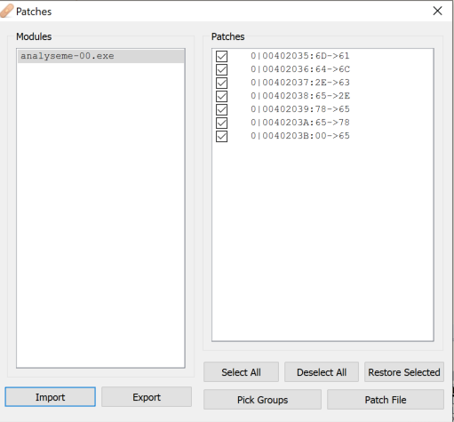

# Patches

Um *patch* é qualquer alteração, seja nos dados ou no código de um programa. O que fizemos na seção anterior é justamente isto. No entanto, não salvamos nossas modificações e neste caso elas serão perdidas caso você feche o x64dbg.

É possível salvar as alterações acessando o menu **View -> Patch file...**, clicando no botão com um pequeno curativo (tipo um band-aid) na barra de ferramentas ou pressionando Ctrl+P.

Se você veio da seção anterior e tem ainda as modificações no AnalyseMe-00, sua tela de patches aparecerá assim:

A partir desta tela, é possível exportá-los para um arquivo (Export), mas também criar um novo arquivo executável com as alterações salvas (Patch File).

Perceba que você pode fazer qualquer tipo de patch, desde uma simples alteração da lógica de um salto até inserir de fato novas funções num programa. Pode dar trabalho, mas é possível. 😉
