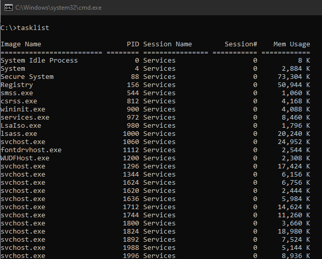

# Processos

Processos é um objeto que representa uma instância de um executável rodando. Processos não rodam. Quem roda mesmo são as threads.

Um processo possui um PID \(Process IDentificator\), uma tabela de _handles_ abertos \(será explicado no capítulo seguinte\), um espaço de endereçamento virtual, dentre outras coisas.

Para ver os processos ativos no seu sistema Windows neste momento, você pode usar o Gerenciador de Tarefas \(aba "Detalhes"\) ou o comando `tasklist`:

Na imagem acima, a coluna **Image Name** define o nome do arquivo executável \(o arquivo no disco\) associado ao processo. Perceba que há vários processos do `svchost.exe` por exemplo. É perfeitamente normal.

