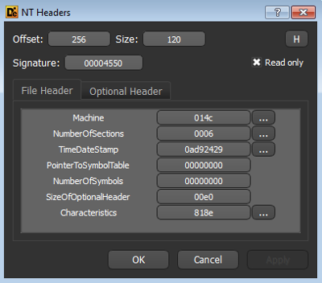

# COFF File

Imediatamente após a assinatura PE temos o cabeçalho COFF \(_Common Object File Format Specification_\) às vezes chamado simplesmente de Cabeçalho do Arquivo \(_File Header_ \) ou mesmo Cabeçalho do Arquivo PE \(_PE File Header_\). Trata-se de um cabeçalho especificado antes mesmo do formato PE para o sistema operacional VAX/VMS \(depois chamado de OpenVMS\) da DEC \(empresa comprada pela Compaq, que por sua vez, foi comprada pela HP\) na década de 70. A razão pela qual a Microsoft teria aproveitado o formato COFF é que boa parte dos engenheiros do time que desenvolveu o Windows NT trabalhavam para a DEC antes.

O cabeçalho COFF possui apenas 20 _bytes_ e é representado pela seguinte estrutura:

```c
typedef struct {
    uint16_t Machine;
    uint16_t NumberOfSections;
    uint32_t TimeDateStamp;
    uint32_t PointerToSymbolTable;
    uint32_t NumberOfSymbols;
    uint16_t SizeOfOptionalHeader;
    uint16_t Characteristics;
} IMAGE_FILE_HEADER, IMAGE_COFF_HEADER;
```

Vamos à definição dos campos importantes para nós:

#### **Machine**

Campo de 2 _bytes_ que define a arquitetura da máquina para qual o programa foi construído. Valores comuns são 0x14c \(Intel i386 ou compatíveis\) e 0x8664 \(AMD64 ou compatíveis\). A tabela completa está disponível na documentação oficial.

#### **NumberOfSections**

Também de 2 _bytes_, o valor deste campo é o número de seções que o arquivo PE em questão possui. As seções serão estudadas mais a frente.

#### **TimeDateStamp**

Este é um número de 32 _bits_ que define o número de segundos desde à meia-noite do dia 1 de Janeiro de 1970, conhecido também por _Epoch time_. Com este valor é possível saber quando o arquivo foi criado. Para mais informações, veja a dica [Convertendo Epoch no Linux](https://www.mentebinaria.com.br/forums/topic/57-convertendo-epoch-no-linux-número-de-segundos-desde-1970-01-01-000000-utc/).

Vale lembrar que este campo não é utilizado pelo _loader_ de arquivos PE no Windows e seu valor pode ser alterado após a compilação, logo, não é 100% confiável, ou seja, você não pode **garantir** que um binário PE foi compilado na data e hora informadas pelo valor neste campo.

#### **SizeOfOptionalHeader**

Contém o tamanho do próximo cabeçalho, conhecido como Cabeçalho Opcional, que estudaremos muito em breve.

#### **Characteristics**

Campo que define alguns atributos do arquivo. Este campo é uma **máscara de bits**, ou seja, cada _bit_ desses 2 _bytes_ diz respeito à uma característica específica do binário. Não cabe aqui explicar todos os possíveis valores, mas os mais comuns são:

| Bit | Nome | Comentários |
| :--- | :--- | :--- |
| 2 | IMAGE\_FILE\_EXECUTABLE\_IMAGE | Obrigatório para arquivos executáveis |
| 9 | IMAGE\_FILE\_32BIT\_MACHINE | Arquivo de 32-bits |
| 14 | IMAGE\_FILE\_DLL | O arquivo é uma DLL |

Vamos agora analisar novamente a Figura 3 para identificar estes campos do cabeçalho COFF, seus valores e significados.

* Logo após a assinatura PE na posição 0xd8 temos o primeiro campo do cabeçalho COFF que é o **Machine**. Ele é um campo de 2 _bytes_ conforme já dito, então os _bytes_ 0x4c e 0x01 definem seu valor. Considerando o _endianess_, chegamos ao valor 0x14c, que define que este executável foi criado para máquinas Intel i386 ou compatíveis.
* Em seguida, na posição 0xde, temos o **NumberOfSections** que é 4.
* Depois vem o campo **TimeDateStamp** com o número inteiro de 32 _bits_ \(4 _bytes_\) sem sinal 0x4ce7979d que é 1290246045 em decimal. Podemos usar o comando **date** do Linux para converter para data e hora atuais:

```text
$ date -ud @1290246045
Sat Nov 20 09:40:45 UTC 2010
```

* Pulamos então 8 _bytes_ referentes aos campos **PointerToSymbolTable** e **NumberOfSymbols** \(normalmente zerados mesmo\), encontrando o valor do da _word_ **SizeOfOptionalHeader** em 0xec de valor 0xe0.
* A próxima _word_ é o valor do campo **Characteristics**, que neste arquivo é 0x102. Convertendo para binário temos o valor 100000010 \(_bits_ 2 e 9 _setados_\) significando que o arquivo é um executável de 32-bits.


Em algumas referências o leitor encontrará o cabeçalho COFF como parte do cabeçalho NT \(IMAGE\_NT\_HEADER\), onde o primeiro campo é chamado de _Signature Bytes_, que é onde fica a assinatura PE para binários PE, mas também pode conter os bytes equivalentes das strings NE, LE ou MZ \(executáveis puros de MS-DOS\). Na verdade o COFF é uma especificação completa para arquivos do tipo "código-objeto", mas não exploraremos seu uso "fora" do formato PE neste livro.


#### Exercícios

Usando o comando **readpe** do toolkit do [pev](http://pev.sf.net), exiba o cabeçalho COFF do binário CRACKME.EXE. Você deve ver algo assim:

```text
C:\Users\Homer\Desktop>readpe --header coff CRACKME.EXE

COFF/File header
Machine:                         0x14c IMAGE_FILE_MACHINE_I386
Number of sections:              6
Date/time stamp:                 182002729 (Wed, 08 Oct 1975 12:18:49 UTC)
Symbol Table offset:             0
Number of symbols:               0
Size of optional header:         0xe0
Characteristics:                 0x818e
                                 IMAGE_FILE_EXECUTABLE_IMAGE
                                 IMAGE_FILE_LINE_NUMS_STRIPPED
                                 IMAGE_FILE_LOCAL_SYMS_STRIPPED
                                 IMAGE_FILE_BYTES_REVERSED_LO
                                 IMAGE_FILE_32BIT_MACHINE
                                 IMAGE_FILE_BYTES_REVERSED_HI
```

Com o **DIE**, é preciso carregar o CRACKME.EXE nele, clicar no botão **PE \(Alt+P\)**, na aba **NT Headers** e por fim, na aba **File Header**. Você deve ver uma janela como a abaixo:



Os botões com "..." localizados ao lado direito de vários valores de campos provêem informações adicionais sobre tais valores. Não deixe de experimentar. ;\)

