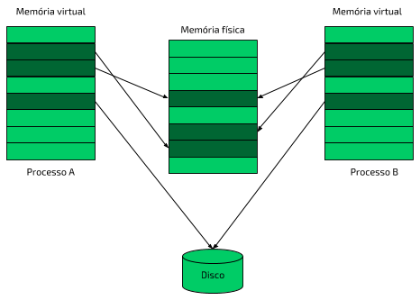

# Endereçamento

## Memória virtual

Onde já se viu dois executáveis com o **ImageBase** em 0x400000 rodarem ao mesmo tempo se ambos são carregados no mesmo endereço de memória? Bem, a verdade é que não são. Existe um esquema chamado de **memória virtual** que consiste num mapeamento da memória RAM real física para uma memória virtual para cada processo no sistema, dando a eles a ilusão de que estão sozinhos num ambiente monotarefa como era antigamente \(vide MS-DOS e outros sistemas antigos\). Essa memória virtual também pode ser mapeada para um arquivo em disco, como o _pagefile.sys_. O desenho a seguir ilustra o mecanismo de mapeamento:



Conforme explicado no capítulo sobre as Seções dos arquivos PE, a memória é dividida em páginas, tanto a virtual quanto a física. No desenho, os dois processos possuem páginas mapeadas pelo _kernel_ \(pelo gerenciador de memória, que é parte deste\) em memória física e em disco \(sem uso no momento\). Perceba que as páginas de memória não precisam ser contíguas \(uma imediatamente após a outra\) no _layout_ de memória física, nem no da virtual. Além disso, dois processos diferentes podem ter regiões virtuais mapeadas para a mesma região da memória física, o que chamamos de páginas compartilhadas.

Em resumo, o sistema gerencia uma tabela que relaciona endereço físico de memória \(real\) com endereço virtual, para cada processo. Todos "acham" que estão sozinhos no sistema, mas na verdade estão juntos sob controle do _kernel_.

## Endereço Virtual

O endereço virtual, em inglês Virtual Address, ou simplesmente VA, é justamente a localização virtual em memória de um dado ou instrução. Por exemplo, quando alguém fazendo engenharia reversa num programa diz que no endereço 0x401000 existe uma função que merece atenção, quer dizer que ela está no VA 0x401000 do binário quando carregado. Para ver a mesma função, você precisa carregar o binário em memória \(normalmente feito com um _debugger_, como veremos num capítulo futuro\) e verificar o conteúdo de tal endereço.

## Endereço Virtual Relativo

Em inglês, _Relative Virtual Address_, é um VA que, ao invés de ser absoluto, é relativo à alguma base. Por exemplo, o valor do campo _entrypoint_ no cabeçalho Opcional é um RVA relativo à base da imagem \(campo _ImageBase_ no mesmo cabeçalho\). Com isso em mente, avalie seu valor na saída a seguir:

```text
Optional/Image header
    Magic number:                    0x10b (PE32)
    Linker major version:            48
    Linker minor version:            0
    Size of .text section:           0x1a00
    Size of .data section:           0x800
    Size of .bss section:            0
    Entrypoint:                      0x39c2
    Address of .text section:        0x2000
    Address of .data section:        0x4000
    ImageBase:                       0x400000
    Alignment of sections:           0x2000
    Alignment factor:                0x200
    Major version of required OS:    4
    Minor version of required OS:    0
    Major version of image:          0
    Minor version of image:          0
    Major version of subsystem:      4
    Minor version of subsystem:      0
    Size of image:                   0x8000
    Size of headers:                 0x200
    Checksum:                        0
    Subsystem required:              0x3 (IMAGE_SUBSYSTEM_WINDOWS_CUI)
    DLL characteristics:             0x8540
    DLL characteristics names
                                         IMAGE_DLLCHARACTERISTICS_DYNAMIC_BASE
                                         IMAGE_DLLCHARACTERISTICS_NX_COMPAT
                                         IMAGE_DLLCHARACTERISTICS_NO_SEH
                                         IMAGE_DLLCHARACTERISTICS_TERMINAL_SERVER_AWARE
    Size of stack to reserve:        0x100000
    Size of stack to commit:         0x1000
    Size of heap space to reserve:   0x100000
    Size of heap space to commit:    0x1000
```

No exemplo acima, o campo _entrypoint_ tem o valor 0x39c2, que é um RVA. Como este campo é relativo ao _ImageBase_, o VA \(endereço virtual\) do _entrypoint_ é então dado pela sua soma com o valor de _ImageBase_:

```text
entrypoint_va = entrypoint_rva + imagebase
entrypoint_va = 0x39c2 + 0x400000
entrypoint_va = 0x4039c2
```


Os RVA's podem ser relativos à outras bases que não a base da imagem. É preciso consultar na documentação qual a relatividade de um RVA para convertê-lo corretamente para o VA correspondente.


