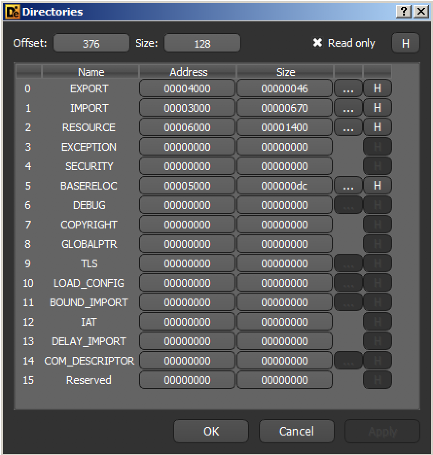
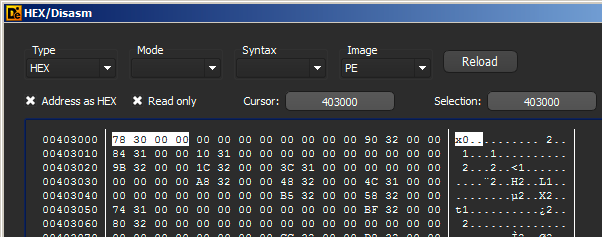
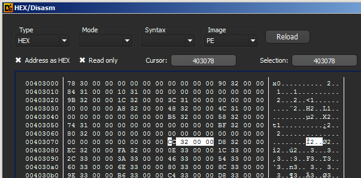
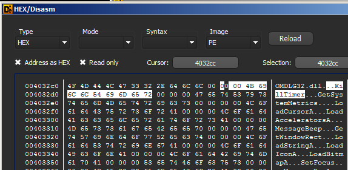

# Import Table

Foi visto que um dos diretórios de dados presentes no cabeçalho opcional é reservado para a _Import Table_, também conhecida por sua sigla IT. Nele há um ponteiro para a IDT \(_Import Directory Table_\), apontado pelo valor do campo _VirtualAddress_.

A IDT, por sua vez, é um _array_ de estruturas do tipo IMAGE\_IMPORT\_DESCRIPTOR definidas a seguir:

```c
typedef struct {
    union {
        uint32_t Characteristics;
        uint32_t OriginalFirstThunk; // Endereço da ILT
    } u1;
    uint32_t TimeDateStamp;
    uint32_t ForwarderChain;
    uint32_t Name; // Endereço do nome da DLL
    uint32_t FirstThunk; // Endereço da IAT
} IMAGE_IMPORT_DESCRIPTOR;
```


Não se deve confundir a IDT \(_Import Descriptor Table_\) com a IDT \(_Interrupt Descriptor Table_\). Esta última é uma estrutura que mapeia interrupções para seus devidos _handlers_, assunto que não é coberto neste livro.


O número de elementos do _array_ de estruturas IMAGE\_IMPORT\_DESCRIPTOR é igual ao número de bibliotecas que o executável PE depende, ou seja, o número de DLL's das quais o executável importa funções. Há ainda um elemento adicional, completamente zero \(preenchido com _null bytes_\) para indicar o fim do _array_.

## OriginalFirstThunk ou rvaImportLookupTable

O campo _OriginalFirstThunk_ \(chamado de _rvaImportLookupTable_ em algumas literaturas\) aponta para o que chamamos _Import Lookup Table \(ILT\)_, um _array_ de números de 32-bits \(64-bits para PE32+\), onde seu _bit_ mais significativo _\(MSB - Most Significant Bit\)_ define se a função será importada por número ordinal \(caso o _bit_ seja 1\). Já no caso de este _bit_ estar zerado, a importação da função dá-se por nome e os outros 31 _bits_ do número representam um endereço para uma estrutura que finalmente contém o nome da função.

Sendo assim, o número de elementos do _array_ ILT é igual ao número de funções importadas por uma DLL em particular, definida na estrutura IMAGE\_IMPORT\_DESCRIPTOR.

## FirstThunk

Este campo aponta finalmente para o que chamamos de _IAT \(Import Address Table\)_, muito conhecida dos engenheiros reversos. Essa tabela é em princípio idêntica à _Import Lookup Table_, mas no processo de carregamento do executável \(_load time_, que estudaremos mais à frente no livro\), é preenchida com os endereços reais das funções importadas. Isto porque um executável dinamicamente _linkado_ não sabe ainda qual o endereço de cada função de cada DLL que ele precisa chamar.

É importante lembrar o conceito de biblioteca compartilhada aqui. A ideia é ter apenas uma cópia dela carregada em memória e todos os programas que a utilize possam chamar suas funções. Por isso todo este esquema de preenchimento da IAT pelo _loader_ é necessário.

Para fixar o conteúdo, é interessante validar tais informações. O exemplo abaixo utiliza o DIE para ver o diretório de dados de um arquivo PE:



Neste exemplo o campo _VirtualAddress_ do _Import Directory_ tem o valor 0x3000. Este é um endereço relativo, que você aprenderá sobre na próxima seção, no entanto, por agora você precisa apenas saber que este endereço é somado ao _ImageBase_ para funcionar. No caso, o _ImageBase_ deste binário é 0x400000 \(muito comum\), então o endereço da _Import Descriptor Table_, apontado por este campo _VirtualAddress_, é 0x403000.


Perceba que o DIE chama o campo _VirtualAddress_ dos diretórios apenas de _Address_.


Ao clicar no botão "H" à direita do diretório IMPORT, vemos o conteúdo do primeiro elemento do _array_ IDT, que é justamente o campo _OriginalFirstThunk_:



Neste exemplo o valor é 0x00003078 \(lembre-se que números são armazenados em _little-endian_\). Sendo novamente um endereço relativo, então o endereço da ILT é 0x403078.

Seguindo este endereço, encontramos achamos a ILT, que é um _array_ de números de 32-bits como já dissemos:



O primeiro número deste _array_ é então 0x000032cc. Como seu MSB está zerado, sabemos que se trata de uma importação por nome \(e não por número da função\). Se seguirmos este endereço, novamente somando o _ImageBase_, finalmente chegamos ao nome da função:



A estrutura que contém o nome da função é chamada de _**Hint/Name Table**_ _\*\*_onde o nome da função começa no terceiro _byte_, neste caso, em 0x4032ce. O tamanho do nome é variável \(naturalmente o tamanho em _bytes_ do nome de uma função pode variar\).

