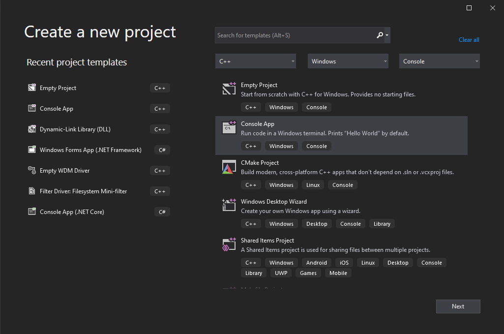
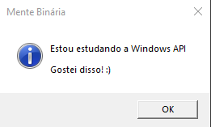

# Caixas de mensagens

## Um "hello, world" conceituado

Vamos programar um pouco. Neste momento é importante, se ainda não o fez, que instale o [Visual Studio Community 2019](https://visualstudio.microsoft.com/vs/community/).

Abra o Visual Studio e crie um novo projeto do tipo Console App, conforme a imagem abaixo mostra:



Nomeie o projeto como "Mensagem" \(sem aspas\) e após criá-lo, substitua o conteúdo do arquivo Mensagens.cpp que o Visual Studio criará automaticamente por este:

```c
#include <Windows.h>

int main() {
	MessageBox(nullptr,
		L"Estou estudando a Windows API\n\nGostei disso! :)",
		L"Mente Binária",
		MB_OK | MB_ICONINFORMATION);

	return EXIT_SUCCESS;
}
```

Tecle F5 para rodar o programa e você deve ver uma janela como esta:



Há vários conceitos escondidos neste código de propósito, de forma que dedeiquemos alguns minutos ao estudo deles. Acompanhe:

* Na **linha 1**, como o Windows utiliza sistemas de arquivos que não são sensíveis ao caso, ou seja, não diferenciam maiúsculas de minúsculas, tanto faz escrever `Windows.h`, `windows.h` ou mesmo `WINDOWS.H`. Vai funcionar.
* Na **linha 4** chamei a função `MessageBox`, mas ela na verdade não existe: é uma macro, substituída pelo pré-processador pelas funções `MessageBoxW` \(mais comum\) ou `MessageBoxA` \(caso a macro `UNICODE` não esteja definida\)
* Ainda na **linha 4** introduzi um conceito novo, de `nullptr` ao invés de `NULL`, aproveitando que o compilador utilizado é de C++. Acho melhor de digitar.
* Nas **linhas 5 e 6** \(sim, não há o menor problema em colocar os outros parâmetros da função em outras linhas para facilitar a leitura\) eu passo para a função o texto e o título, respectivamente. Impossível não notar o `L` colado com as aspas duplas que abrem uma string em C não é mesmo? Ele serve para transformar a string subsequente em uma **wide** string \(UNICODE\), que já estudamos. É necessário para a função `MessageBoxW` \(perceba o `W` no final\) que subsituirá a função `MessageBox` neste código. Também usamos o caractere de nova linha `\n` duas vezes para dividir a mensagem em três linhas, sendo a segunda vazia.
* Na **linha 7** eu utilizo uma combinação de duas flags: `MB_OK` __e `MB_ICONINFORMATION`. Esta última configura este ícone de um "i" numa bolinha azul.
* Por fim, **na linha 9**, utilizo a macro `EXIT_SUCCESS`, que expande para `0`. Sua contraparte é `EXIT_SUCCESS`, que expande para `1`.

## Lendo o retorno da função

Agora vamos criar um programa um pouco maior afim de estudar mais conceitos da API do Windows. Compila aí:

```c
#include <Windows.h>

int main() {

	LPCWSTR titulo = L"Mente Binária";
	
	int ret = MessageBoxW(nullptr,
		L"Você já se registrou em https://menteb.in?",
		titulo,
		MB_YESNO | MB_ICONQUESTION);

	if (ret == IDYES) {
		MessageBoxW(nullptr, L"Aê! Isso é ser inteligente!", titulo, MB_OK);
	}
	else if (ret == IDNO) {
		MessageBoxW(nullptr, L"Tá esperando o que então? Vai lá!", titulo, MB_OK); 
	}

	return EXIT_SUCCESS;
}
```

Vamos analisar os conceitos novos aqui, como fizemos com o programa anterior:

* Na linha 5 declaro uma variável do tipo `LPCWSTR`. A diferença de `LPCSTR`, que já estudamos, é este "W", de _wide_, para definir uma string UNICODE.
* A linha 7 declara uma variável `ret` do tipo `int` e já a inicializa com o retorno da chamada à `MessageBoxW`.
* Nas linhas 12 e 15 comparo o conteúdo da variável `res`, que detém o retorno da chamada à `MessageBoxW`. Se for igual a `IDYES`, novamente uma macro, mostra uma determinada mensagem. Se for igual a `IDNO`, mostra outra.


Em relação às strings, há três maneiras de se programar com a Windows API: ASCII \(`CHAR`\), UNICODE \(`WCHAR`\) ou em compatibilidade \(`TCHAR`\), que vai ser `CHAR` ou `WCHAR`, caso `UNICODE` esteja definida. Sinceramente, não há razão para não utilizar o padrão UNICODE e portanto usaremo-os bastante neste livro.


A tabela abaixo, retirada de uma [resposta a uma dúvida na MSDN](https://social.msdn.microsoft.com/forums/vstudio/en-US/1b994ff3-da28-46a8-90ef-6c7fab8dcd21/lpctstr#e4e05bbe-7cb8-4321-97de-fcf1c435952e), ajuda na compreensão:

| Tipo | Expansão |
| :--- | :--- |
| LPSTR | char\* |
| LPCSTR | const char\* |
| LPWSTR | wchar\_t\* |
| LPCWSTR | const wchar\_t\* |
| LPTSTR | char or wchar\_t dependendo da \_UNICODE |
| LPCTSTR | const char or const wchar\_t dependendo da \_UNICODE |

